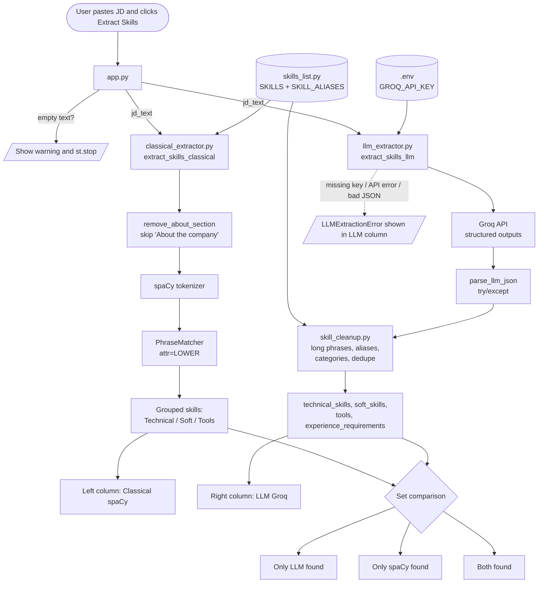
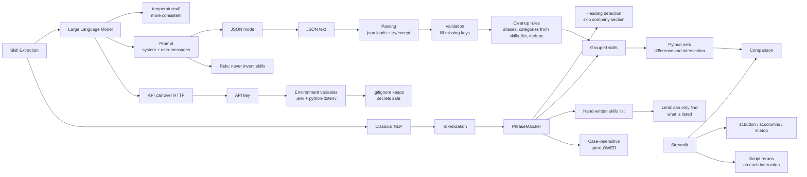
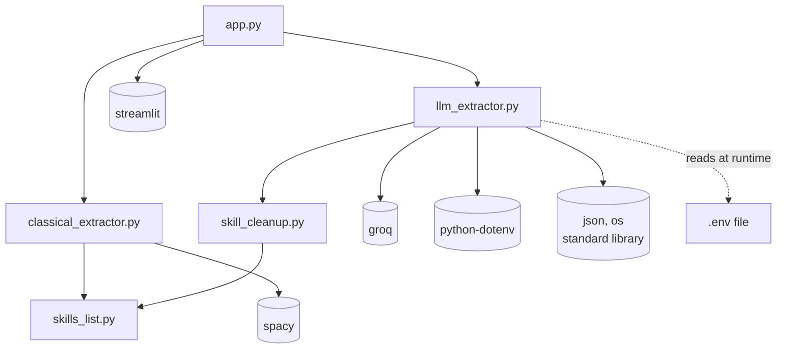

# Knowledge Graph

Visual maps of the project. GitHub and VS Code (with a Mermaid extension) render these diagrams automatically.

---

## 1. Data-flow diagram

How a job description moves through the app.

---

## 2. Concept map

How the ideas behind the project connect.

---

## 3. File dependency map

Which file imports which. Arrows point from the importer to the file or package it imports.

Notes:
- `skills_list.py` imports nothing, because it is pure data. Both `classical_extractor.py` and `skill_cleanup.py` read it, so there is one source of truth for skills and tools.
- `classical_extractor.py` and `llm_extractor.py` don't know about each other or about Streamlit. They can be tested or reused on their own.
- Only `app.py` knows about the UI. This is called **separation of concerns**.
